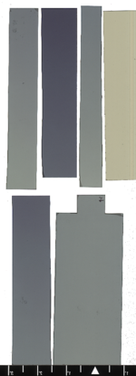

# Calibración Irradiador Cs-137 MDS Nordion

### Departamento de Radiología, Rehabilitación y Fisioterapia
#### Universidad Complutense de Madrid
------------
17 de junio de 2024
## Introducción

La UCM cuenta con un [irradiador de sangre](http://bpharma-basic.net/Gammacell%20Irradiator.pdf) que se utiliza para investigación. Mediante este informe se documentan las medidas realizadas para comprobar su calibración en *dosis impartida por unidad de tiempo de irradiación*.

## Procedimiento

Se emplean películas radiocrómicas irradiadas en el seno de un maniquí cilíndrico lleno de agua. 
Se miden planos de dosis que pasan por su eje longitudinal y cortan el cilindro verticalmente en dos mitades iguales.

Para realizar la calibración se han considerado tres niveles de dosis nominales: 2.05, 4.1 y 8.2 Gy correspondientes a tiempos de irradiación de 22 segundos, 44 segundos y 1 minuto 28 segundos según indica el *Display* del irradiador. 

La calibración se realizará respecto a la indicación de la dosis central. Esta dosis se entiende referida al punto central del volumen de irradiación en el seno del agua. La indicacción de dosis mínima se entiende que corresponde a la dosis en el centro de la base y de la tapa del cilindro del volumen de irradiación, donde la intensidad de la radiación cae por la geometría de la fuente y donde es mayor la atenuación producida por el agua. 

Cada nivel de dosis se ha medido irradiando simultáneamente dos películas.

La siguiente imagen muestra las películas ya irradiadas

Cada película irradiada se ha digitalizado dos veces.

Las imágenes digitalizadas se han procesado mediante un protocolo de digitalización única y promedios no locales. El procesado cuenta con chequeos adicionales de control de calidad que garantizan que la calibración del sistema de dosimetría radiocrómica es correcta. Consisten en medir distribuciones de dosis conocidas de valores similares a los de las dosis que se quieren determinar en el irradiador.

Las dosis leídas están guardadas en formato dxf, un formato de intercambio de datos desarrollado por  Varian. Son archivos csv con un encabezado de metainformación.

Los resultados son reproducibles reanalizando las imágenes digitalizadas mediante la aplicación [chromlit](https://chromlit.streamlit.app)

## Resultados

La siguiente figura muestra el resultado de las medidas de la calibración

En esta figura se muestra la comparación entre la distribución de dosis proporcionada por el fabricante del irradiador con la medida

## Conclusiones

Los resultados indican un error en el factor de calibración del orden del 5% y un error de cero de 0.25 Gy.

Hay que tener en cuenta que el cilindro de agua que hemos utilizado no ajusta completamente en el portamuestras, el diámetro es inferior en aproximadamente 1 cm. Del mapa de isodosis podemos estimar que eso supone una atenuación inferior en un 4% ó 5% que justificaría la diferencia en el factor de calibración. 

Por tanto el único error en la calibración es el error sistemático de cero que para irradiaciones típicas de 25 Gy sería un error del orden del 1%.

